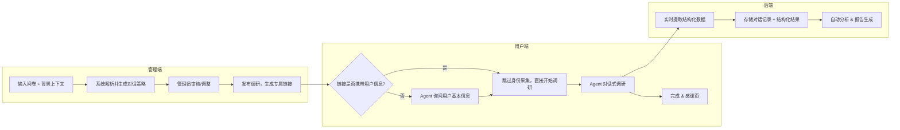
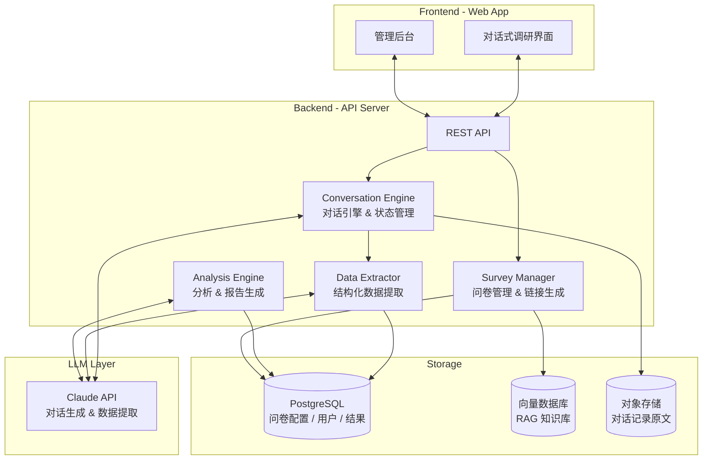

# Agent Driven Survey — 背景需求文档

## 项目概述

Agent Driven Survey 是一个**独立的 Web 服务**，后端对接大模型（如 Claude），用 LLM Agent 替代传统静态问卷，实现**动态生成、对话式采集、自动分析**的全链路调研能力。

**核心流程**：管理员输入一份问卷 + 背景上下文 → 系统生成专属调研链接 → 用户打开链接进入对话式调研 → Agent 自动完成采集与分析。

本文档为 Claude Code 方案设计与开发提供完整的设计指导。

---

## 1. 设计灵感：Anthropic Interviewer

<aside>
💡

**核心灵感来源**：[Anthropic Interviewer](https://www.anthropic.com/research/anthropic-interviewer)（2025.12）— Anthropic 发布的 AI 驱动访谈工具，用 Claude 自动完成大规模用户深度访谈。这是本项目的核心参考范式。

</aside>

### 1.1 Anthropic Interviewer 是什么

Anthropic 构建了一个名为 **Anthropic Interviewer** 的工具，用 Claude 驱动，自动进行深度用户访谈。首次测试中，它完成了 **1,250 场专业人士访谈**（通用职场 1,000 人 + 科学家 125 人 + 创意工作者 125 人），每场 **10-15 分钟**，探索 AI 在工作中的使用模式、情感态度和未来展望。

**关键成果**：

- 97.6% 的参与者对访谈体验满意度评分 ≥ 5/7
- 96.96% 认为对话准确捕捉了他们的想法
- 99.12% 会向他人推荐这种访谈形式
- 传统方式做 1,250 场深度访谈成本极高且耗时，AI Interviewer 实现了前所未有的规模化

### 1.2 三阶段方法论（核心架构参考）

Anthropic Interviewer 的工作流程分为三个阶段，**这是我们系统设计的直接蓝本**：

**阶段 1：Planning（规划）**

- 研究员定义研究目标和假设
- AI 基于目标自动生成**访谈计划**（问题列表 + 对话流设计）
- 人工审核并调整计划
- 关键设计：计划足够结构化以保证一致性，但也足够灵活以适应个体差异和意外展开

**阶段 2：Interviewing（访谈执行）**

- AI 按照访谈计划进行**实时自适应访谈**
- 在 Web 界面上以对话形式呈现
- 系统提示词中嵌入了访谈最佳实践
- 能根据受访者回答动态调整提问方向和深度

**阶段 3：Analysis（分析）**

- 人类研究员与 AI 协作分析访谈文本
- 输入：访谈计划 + 全部对话记录
- 输出：研究问题的回答 + 代表性引用
- 另有独立 AI 分析工具进行**主题聚类**和**定量统计**（如情感分布、主题覆盖率）

### 1.3 对我们项目的关键启示

| **Anthropic 的做法** | **对 Agent Driven Survey 的启示** |
| --- | --- |
| 研究目标 → AI 生成访谈计划 → 人工审核 | 管理员输入问卷+背景，系统自动理解并生成对话策略，管理员审核后发布 |
| 结构化计划 + 灵活追问的平衡 | 问卷 Schema 定义「核心必答」和「动态追问」两层，确保数据可比性的同时允许深度探索 |
| 对话式访谈而非表单填写 | 用自然对话替代勾选题，显著提升参与意愿（99% 推荐率）和数据质量 |
| 定量问卷 + 定性访谈结合 | Agent 在对话中同时收集结构化数据（评分）和非结构化数据（开放叙述），一次完成定量+定性 |
| 10-15 分钟访谈时长 | 目标对话时长控制在 10-15 分钟 |
| AI 自动主题聚类 + 情感分析 | 分析引擎应支持按用户画像分群的主题聚类和情感分析 |

---

## 2. 系统定位与核心流程

### 2.1 系统定位

这是一个**独立部署的 Web 服务**，不依赖任何现有问卷系统。核心能力：

- 接受任意问卷 + 背景上下文作为输入
- 为每次调研生成**专属的 Web 链接**
- 通过 LLM 驱动的自然对话完成用户调研
- 自动提取结构化数据并生成分析报告

### 2.2 核心使用流程



### 2.3 输入方式

系统支持两种输入方式：

**方式 A：直接输入（MVP）**

- 管理员上传/粘贴一份**问卷文档**（支持 JSON/YAML/Markdown/纯文本）
- 附带**背景上下文**：产品描述、调研目的、目标用户群体、关注重点等
- 系统解析后生成对话策略

**方式 B：Notion Database / RAG 输入（扩展）**

- 连接 Notion Database 获取问卷数据和相关文档
- 对文档内容进行向量化，构建知识库
- Agent 在对话中可通过 RAG 检索相关上下文，提供更精准的追问

### 2.4 链接与用户身份

每次发布调研后，系统生成一个专属 Web 链接：

- **携带用户信息**：`https://survey.example.com/s/{survey_id}?uid={user_id}&name={name}&...`
    - 系统自动识别用户身份，跳过身份采集环节
    - 适合 App 内弹窗跳转、邮件邀请等已知用户场景
- **不携带用户信息**：`https://survey.example.com/s/{survey_id}`
    - Agent 在对话开始时友好地询问基本信息（如姓名/角色/使用场景等）
    - 适合公开分享、社区投放等匿名场景

---

## 3. 系统架构

### 3.1 整体架构



### 3.2 核心模块说明

**模块 1：Survey Manager（问卷管理器）**

- 接收问卷输入（文本/JSON/Notion Database）
- 解析问卷结构，生成内部 Schema
- 对背景上下文进行向量化存储（用于 RAG）
- 生成专属调研链接，管理调研生命周期（草稿/进行中/已结束）

**模块 2：Conversation Engine（对话引擎）**

- 核心运行时模块，管理每个用户的对话会话
- **对话状态机**：跟踪已完成/进行中/待问的问题
- 构建 System Prompt：将问卷 Schema + 背景上下文 + 用户已知信息 + 对话历史组装为 LLM 提示词
- 关键能力：
    - 动态追问：回答深度不足时自动追问
    - 智能跳题：根据已知信息跳过无关问题
    - 情感感知：检测用户不耐烦时调整节奏
    - 多语言：自动检测并适配用户语言
    - 会话恢复：用户中断后可从断点继续

**模块 3：Data Extractor（数据提取器）**

- 从对话文本中实时提取结构化字段
- 使用 LLM 的 structured output 能力（如 tool_use / JSON mode）
- 提取维度：评分、选项选择、关键词、情感倾向、用户画像字段
- 每轮对话后增量更新，非对话结束后批量处理

**模块 4：Analysis Engine（分析引擎）**

- 单份分析：生成个人调研摘要（关键观点、情感标签）
- 聚合分析：跨用户的主题聚类、情感分布、NPS 统计
- 交叉分析：用户画像 × 满意度维度的分群对比
- 报告生成：自动输出结构化分析报告

---

## 4. 问卷 Schema 设计

### 4.1 Schema 结构

问卷 Schema 是连接「静态问卷输入」和「动态对话执行」的桥梁。管理员输入原始问卷后，系统将其转换为内部 Schema：

```json
{
  "survey_id": "omada-app-ux-2026",
  "title": "Omada App 用户体验调研",
  "description": "了解用户使用习惯、满意度和改进建议",
  "context": {
    "product": "Omada App - 网络设备管理应用",
    "target_users": "IT 管理员、网络工程师、SOHO 用户",
    "focus_areas": ["易用性", "性能", "功能完整性"]
  },
  "user_identity_fields": [
    { "key": "role", "label": "您的角色", "type": "text", "required": true },
    { "key": "network_scale", "label": "管理的设备数量", "type": "select", "options": ["1-10", "11-50", "50+"] }
  ],
  "sections": [
    {
      "id": "usage",
      "topic": "使用行为",
      "core_questions": [
        {
          "id": "q1",
          "intent": "了解用户使用 App 的频率和主要场景",
          "type": "open",
          "follow_up_rules": [
            { "condition": "mentions_issue", "action": "深入追问具体问题" },
            { "condition": "answer_too_brief", "action": "引导举例说明" }
          ]
        }
      ],
      "extract_fields": [
        { "key": "usage_frequency", "type": "select", "options": ["daily", "weekly", "monthly", "rarely"] },
        { "key": "primary_scenarios", "type": "multi_select", "options": ["monitoring", "config", "troubleshooting", "firmware"] }
      ]
    },
    {
      "id": "satisfaction",
      "topic": "满意度评估",
      "core_questions": [
        {
          "id": "q5",
          "intent": "评估用户对 App 各维度的满意度",
          "type": "rating",
          "dimensions": ["易用性", "响应速度", "功能完整性", "稳定性"],
          "scale": "1-5",
          "follow_up_rules": [
            { "condition": "rating <= 2", "action": "追问具体不满原因" },
            { "condition": "rating >= 4", "action": "了解最满意的点" }
          ]
        }
      ]
    },
    {
      "id": "nps",
      "topic": "推荐意愿",
      "core_questions": [
        {
          "id": "q8",
          "intent": "NPS 评分及原因",
          "type": "nps",
          "follow_up_rules": [
            { "condition": "score <= 6", "action": "深入挖掘不推荐的原因" },
            { "condition": "score >= 9", "action": "了解推荐理由和亮点" }
          ]
        }
      ]
    }
  ],
  "settings": {
    "max_duration_minutes": 15,
    "language": "auto",
    "tone": "friendly_professional"
  }
}
```

### 4.2 从原始问卷到 Schema 的转换

管理员不需要手写 Schema，系统用 LLM 自动转换：

1. 管理员上传原始问卷（任意格式） + 背景说明
2. LLM 解析问卷结构，识别问题意图、类型、逻辑关系
3. 自动生成 Schema + 对话策略建议
4. 管理员在后台审核、调整后确认发布

---

## 5. 对话引擎设计要点

### 5.1 System Prompt 构建

对话引擎的核心是为每次会话动态构建 System Prompt：

```
[角色定义] 你是一位友好专业的用户调研员...
[问卷目标] {survey.description}
[产品背景] {survey.context} + RAG 检索结果
[用户已知信息] {从 URL 参数或前序对话中获取的用户画像}
[问卷结构] {当前 section 的问题 + 追问规则}
[对话进度] 已完成: [...], 当前: q5, 待问: [...]
[行为约束] 每次只问一个问题；追问不超过2轮；检测到不耐烦时加速推进...
```

### 5.2 对话状态管理

| **状态** | **说明** |
| --- | --- |
| `not_started` | 问题尚未触达 |
| `in_progress` | 正在进行中（含追问） |
| `answered` | 已获得足够信息，数据已提取 |
| `skipped` | 根据跳题规则或用户拒答跳过 |

### 5.3 关键交互模式

- **开场**：如 URL 携带用户信息则确认并开始；否则自然地询问基本信息
- **过渡**：在 section 之间自然过渡（"聊完使用习惯，我们来聊聊您对 App 的整体感受"）
- **追问**：基于 follow_up_rules 和 LLM 判断动态追问，但单个问题追问不超过 2 轮
- **收尾**：总结关键发现，邀请补充，感谢参与

---

## 6. 技术约束与选型建议

### 6.1 技术栈

| **层级** | **建议选型** | **理由** |
| --- | --- | --- |
| Frontend | React / Next.js | SSR 支持 SEO、链接预览；组件化对话 UI |
| Backend | Python (FastAPI) 或 Node.js | LLM SDK 生态好；FastAPI 适合 async streaming |
| LLM | Claude API (Anthropic) | 多语言强、长上下文、支持 structured output (tool_use) |
| Database | PostgreSQL | 问卷配置、用户会话、结构化结果 |
| 向量数据库 | Chroma / Qdrant / pgvector | RAG 背景知识检索 |
| 对象存储 | S3 / MinIO | 对话记录原文存档 |
| 部署 | Docker + Cloud (AWS/Vercel) | MVP 快速上线 |

### 6.2 LLM 调用策略

- **对话生成**：使用 streaming 模式，降低用户等待感
- **数据提取**：每轮对话后异步调用 LLM 进行 structured extraction
- **Schema 转换**：管理员上传问卷时一次性调用 LLM 生成 Schema
- **分析报告**：批量调用 LLM 进行聚合分析
- **成本控制**：Sonnet 用于对话和提取，Opus/高级模型用于分析报告

### 6.3 关键设计约束

- **对话时长**：目标 10-15 分钟，超时则加速收尾
- **多语言**：LLM 原生支持，自动检测用户语言并适配
- **并发**：需支持多用户同时参与同一调研
- **隐私**：URL 中的用户信息应加密传输；对话数据存储需考虑 GDPR 合规
- **会话恢复**：用户中途离开后可通过同一链接恢复对话

---

## 7. MVP 范围

### Phase 1：核心对话引擎（MVP）

- [ ]  管理后台：上传问卷 + 背景上下文，生成调研链接
- [ ]  问卷 Schema 自动转换（LLM 解析原始问卷）
- [ ]  对话引擎：基于 Schema 进行自然对话式调研
- [ ]  URL 参数携带用户信息 / 无参数时询问用户信息
- [ ]  实时数据提取：从对话中提取结构化字段
- [ ]  Web 对话 UI：简洁的聊天界面
- [ ]  数据导出：CSV / JSON
- [ ]  测试输入：Omada App 用户调研问卷

### Phase 2：分析与增强

- [ ]  单份调研摘要自动生成
- [ ]  聚合分析：跨用户主题聚类 + 情感分布
- [ ]  分析仪表盘（管理端可视化）
- [ ]  多语言自动适配
- [ ]  会话恢复（中断续接）

### Phase 3：RAG 与集成

- [ ]  Notion Database 数据源接入 + 向量化
- [ ]  RAG 增强对话（Agent 检索产品知识回答用户反问）
- [ ]  Webhook / API 回调（调研完成后通知外部系统）
- [ ]  调研结果自动写入外部系统（如 Notion Database）

---

## 8. 测试用例：Omada App 调研问卷

首个测试输入为已设计的 [Omada App用户调研问卷设计](https://www.notion.so/Omada-App-2b615375830d8050af16f6d877f51121?pvs=21)（27 题 Controller 模式问卷），覆盖：

- **用户画像层（WHO）**：使用场景、管理模式、网络规模、职业
- **使用行为层（HOW）**：使用频率、App vs PC、常用操作、竞品经验
- **体验评价层（SATISFACTION）**：7 维度满意度 + NPS + 条件追问

验证目标：系统能否将这份 27 题静态问卷转换为 10-15 分钟的自然对话，并提取出等价或更丰富的结构化数据。

---

## 9. 开放问题（待 Claude Code 设计时明确）

1. **问卷 Schema 格式**：最终采用 JSON 还是 YAML？追问规则的 DSL 如何设计？
2. **对话状态持久化**：用 DB 还是 Redis？会话恢复的过期策略？
3. **数据提取时机**：逐轮提取 vs 对话结束后批量提取？实时性 vs 准确性权衡
4. **LLM 上下文窗口**：长对话如何处理 context window 限制？滑动窗口还是摘要压缩？
5. **安全性**：链接是否需要时效限制？用户信息加密方案？
6. **管理端权限**：是否需要多用户协作管理问卷？

---

## 10. 参考资料

- ⭐ [Anthropic Interviewer](https://www.anthropic.com/research/anthropic-interviewer) — **核心灵感来源**。三阶段方法论（Planning → Interviewing → Analysis），1,250 场访谈，99% 推荐率
- [Kurmich/ai-agent-based-survey](https://github.com/Kurmich/ai-agent-based-survey) — 开源 LLM 对话式问卷实现（[Bland.ai](http://Bland.ai) + GPT-4o + REDCap）
- [CrewAI 2026 Agentic AI Survey Report](https://crewai.com/ai-agent-survey) — Agentic AI 行业趋势参考
- [Lyzr Employee Satisfaction Survey Agent](https://www.youtube.com/watch?v=2ORhveDuFX4) — Agent 自动化调研流程参考